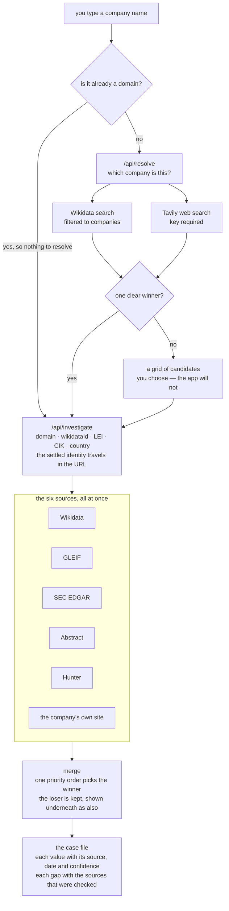

# Detective Gabi

*Company research, with its sources.*

Type a company name, get a case file: where it is, how old it is, how big it is, and who
decides. Every value carries the source it came from, the date it was true, and how much to
trust it. When nothing is found it says so, and lists where it looked.

**Live demo:** _(added at deploy)_

## The one rule

**The app never invents data.** A field with no source reads `No evidence found` and names the
sources that were checked — never an estimate, never a plausible guess. An email derived from a
pattern is never marked verified. When two sources disagree, both are shown and neither is
hidden.

Three tests were written before the code they guard, and each carries a positive control: a
guard that only ever refuses would pass the first two while making the badge it protects
meaningless.

## How a name becomes a case file



Three things that diagram is precise about:

- **A name is identified before it is investigated.** Asking six sources about "Basecamp" makes
  each of them guess which one you meant. Resolution answers that question first, and hands the
  investigation an identity rather than a word.
- **The six run at the same time**, and no part of the bar inks before its source has answered.
  The pacing can lag the facts; it never leads them. The bar is a count — the log underneath is
  what says a source failed, and why.
- **The merge keeps what it does not use.** Losing values are not discarded; they sit under the
  winner so you can compare them.

### Who answers what

Every provider declares what it can cover, and the report never claims a source was consulted
for a field it does not read.

| Source | Key | Covers | Notes |
|---|---|---|---|
| Wikidata | — | location, year founded, employees, people | the broadest, and free |
| GLEIF | — | location | official registry, worldwide, legal entities |
| SEC EDGAR | — | location | official filings, US-listed companies only |
| Abstract | required | location, year founded, employees | one request answers all three |
| Hunter | required | people | bills per email returned, so the request caps at three |
| The company's site | extraction key | people | slowest by far, so it runs last |

Priority on merge, highest first:
`edgar > gleif > wikidata > abstract > hunter > website > web > llm`. An official registry
outranks an aggregator, which outranks a company's own words about itself.

## Run it

```bash
npm install
cp .env.example .env.local   # every key is optional
npm run dev
```

**With no keys at all it runs on Wikidata, GLEIF and SEC EDGAR** — three sources, two of them
official registries, and a real report with nothing configured. Keys add the rest:

| Variable | Unlocks | Free tier |
|---|---|---|
| `ABSTRACT_API_KEY` | location, year, headcount from a domain | 100 requests for the life of the account |
| `HUNTER_API_KEY` | decision-makers' emails | 50 credits a month, one per email returned |
| `TAVILY_API_KEY` | web search during resolution | 1,000 credits a month |
| `GEMINI_API_KEY` | reading people out of a company's own pages | per-minute and per-day limits |
| `EDGAR_USER_AGENT` | not a key: the SEC drops callers it cannot identify | — |

You can also paste your own keys into the app. They are held in that tab, sent as a header on
each request, and never stored on the server.

```bash
npm test        # 540 tests, no network in any of them
npm run typecheck
```

The fixtures are recordings of real calls, not illustrations written by hand.

## The plan, written before the code

- [`SPEC.md`](SPEC.md) — what it does, the data contract, the error states
- [`PLAN.md`](PLAN.md) — the architecture and the provider seam
- [`TASKS.md`](TASKS.md) — the build broken into commits
- [`docs/02-architecture.md`](docs/02-architecture.md) — where the boundaries are, in the code
  as committed
- [`docs/03-decisions.md`](docs/03-decisions.md) — every decision, with the option rejected
- [`docs/04-limitations.md`](docs/04-limitations.md) — what is still wrong, with the measurement
  that found it
- [`docs/05-ai-usage.md`](docs/05-ai-usage.md) — how AI was used, and what was rejected
